# 🧩 DevOps Mini Blog Project — Full Stack Deployment with CI/CD, Docker, AWS & Terraform

- [🧩 DevOps Mini Blog Project — Full Stack Deployment with CI/CD, Docker, AWS \& Terraform](#-devops-mini-blog-project--full-stack-deployment-with-cicd-docker-aws--terraform)
  - [🏗️ Project Overview](#️-project-overview)
  - [⚙️ Application Stack](#️-application-stack)
  - [Quick local run (dev)](#quick-local-run-dev)
  - [☁️ Infrastructure and Deployment](#️-infrastructure-and-deployment)
    - [🧩 1. Infrastructure as Code with Terraform](#-1-infrastructure-as-code-with-terraform)
  - [](#)
    - [🌐 2. AWS EC2 Deployment](#-2-aws-ec2-deployment)
  - [**Considerations**](#considerations)
    - [🐳 3. Docker Containerization](#-3-docker-containerization)
    - [🔄 4. CI/CD Pipeline — GitHub Actions](#-4-cicd-pipeline--github-actions)
    - [☁️ 5. Terraform Cloud Integration](#️-5-terraform-cloud-integration)
  - [🧠 AI Integration (OpenRouter / OpenAI API)](#-ai-integration-openrouter--openai-api)
  - [🔐 Environment Variables](#-environment-variables)
  - [📊 Logging and Security](#-logging-and-security)
  - [🧱 Architecture Diagram](#-architecture-diagram)
  - [Future Considerations](#future-considerations)
    - [Network \& Perimeter](#network--perimeter)
    - [Identity \& Access Management (IAM)](#identity--access-management-iam)
    - [Secrets \& Configuration](#secrets--configuration)
    - [Data protection \& persistence](#data-protection--persistence)
    - [Runtime security (containers and hosts)](#runtime-security-containers-and-hosts)
    - [Monitoring and Audit](#monitoring-and-audit)
    - [CI/CD Security](#cicd-security)
    - [Private Mongo on EC2](#private-mongo-on-ec2)
    - [Terraform modules](#terraform-modules)
    - [Example small IAM policy snippets (illustrative)](#example-small-iam-policy-snippets-illustrative)

## 🏗️ Project Overview

This project demonstrates a **complete DevOps workflow** — from local application development to automated deployment on the cloud.  
It integrates **Node.js**, **MongoDB**, **Docker**, **AWS**, **Terraform**, and **GitHub Actions** to show how modern infrastructure and automation can deliver a full-stack web application.

The project’s main goal is to **build and deploy a Node.js + MongoDB blog application** with:
- Automated provisioning of infrastructure via **Terraform**
- Containerization and orchestration via **Docker Compose**
- Continuous Integration and Continuous Deployment (CI/CD) using **GitHub Actions**
- Hosting on **AWS EC2** - using **AWS Free Tier**
- Secure, environment-based configuration management
- Optional **AI assistant integration** using the OpenRouter API

---

## ⚙️ Application Stack

| Component | Description |
|------------|-------------|
| **Node.js / Express** | Backend web application server |
| **MongoDB** | NoSQL database for storing blog posts and visitor analytics |
| **EJS Templates** | Used for rendering dynamic HTML pages |
| **Axios** | To communicate with external APIs (AI assistant) |
| **Helmet + Morgan** | Security headers and logging |
| **OpenRouter API (GPT model)** | Provides AI-generated blog content suggestions |

The application allows users to:
- Create and view blog posts
- Count visits and uptime
- Interact with an AI assistant that generates text responses

---
## Quick local run (dev)
1. `cd app`
2. Create a `.env` and create an API Key with `https://openrouter.ai/` and populate it.
3. Run `docker compose up --build`
4. Visit `http://localhost:3000`
   - You can create posts which will be in your MongoDB
   - The Visits are also a collection in your MongoDB
   - You have an AI assistant that can help with your DevOps Projects (or anything you want)
5. Images of local deployment:
   - 
   - 
   - 
   - 

---

## ☁️ Infrastructure and Deployment

### 🧩 1. Infrastructure as Code with Terraform

Terraform was used to **automate the provisioning** of the required AWS resources.

**Key Terraform Resources:**
- **AWS EC2 Instance** — runs the Dockerized app
- **Security Group** — controls inbound access (ports 22 and 3000)
- **Key Pair** — for secure SSH connection
- **Subnets / VPC** — network configuration (default VPC used)
- **User Data Script** — automatically installs Docker, clones the repo, and runs containers

**Why Terraform?**
- Enables repeatable, version-controlled infrastructure
- Provides easy teardown and recreation of the environment
- Integrates seamlessly with GitHub Actions and Terraform Cloud

**Terraform Workflow**
```bash
   cd terraform/docker-compose-ec2
   terraform init
   terraform plan
   terraform apply
   # to destroy infra
   terraform destroy
```


---

### 🌐 2. AWS EC2 Deployment

The EC2 instance is automatically provisioned and configured by Terraform.  
Upon creation, a **user data script** ([user-data.sh](terraform/docker-compose-ec2/user-data.sh)) executes the following steps:

1. Updates Ubuntu packages  
2. Installs **Docker** and **Docker Compose plugin**  
3. Clones the GitHub repository  
4. Builds and starts the containers using Docker Compose  
5. Runs the application automatically on port `3000`

This means **no manual SSH setup** is needed — everything is automated through Terraform.

**Images of EC2 deployment**
- Frontend EC2 page:

- Frontend EC2 AI assistant:

- Posts Page (**MongoDB**)


**Considerations**
- 

---

### 🐳 3. Docker Containerization

Both the **Node.js application** and **MongoDB** run in containers.

**Docker Compose Setup:**
- `app` container — runs the Node.js Express server
- `mongo` container — runs MongoDB
- Containers are networked together internally via Docker Compose
- Volumes are used to persist MongoDB data

This setup ensures:
- Portability (runs the same locally or on EC2)
- Simpler configuration and deployment
- Isolated environment for development and production

---

### 🔄 4. CI/CD Pipeline — GitHub Actions

**GitHub Actions** is configured to handle the **continuous integration and deployment (CI/CD)** process.

**Workflow Overview:**
1. On every `push` or `merge` to `main`, GitHub Actions:
   - Checks out the repository
   - Configures AWS credentials from GitHub Secrets
   - Initializes and applies the Terraform configuration

2. Terraform then provisions or updates the AWS infrastructure automatically
3. Docker and the application start on the new or existing EC2 instance
4. For testing purposes (just in "development") - included a `terraform destroy` within a `destroy.yml` pipeline
   - .

**Front Page with CI/CD pipeline**


**Benefits:**
- Fully automated deployment pipeline
- No manual AWS console interaction
- Version-controlled infrastructure
- Rapid iteration and testing

---

### ☁️ 5. Terraform Cloud Integration

To improve state management and team collaboration, **Terraform Cloud** was used to:
- Store Terraform state files securely
- Manage workspace variables (AWS keys, MongoDB URI, OpenAI API key)
- Trigger automated Terraform runs from GitHub
- Keep a detailed run history and audit log
   - **Log for Terraform destroy triggered by GitHub Actions**: 
- Variables from AWS to be used in Terraform Cloud.
      
- In the future, want to store state file on an **S3 bucket** with state locking on **DynamoDB**.

---

## 🧠 AI Integration (OpenRouter / OpenAI API)

The blog app includes a feature that integrates with **OpenRouter’s GPT model API** for AI text generation.

**How it works:**
- Users can type a prompt into the AI assistant box.
- The Node.js backend sends the prompt to the OpenRouter API endpoint.
- The model returns a generated response which is displayed on the frontend.

**Key Features:**
- Works with a free model (`openai/gpt-oss-20b:free`)
- Uses an environment variable for the API key
   - 
- Gracefully handles errors when the key is not set

---

## 🔐 Environment Variables

| Variable | Description | Example |
|-----------|-------------|----------|
| `MONGO_URI` | MongoDB connection string | `mongodb://localhost:27017/blog` |
| `OPENAI_API_KEY` | API key for OpenRouter | `sk-xxxx` |
| `PORT` | Application port | `3000` |

These are passed into the container through Docker Compose or Terraform user data.

---

## 📊 Logging and Security

- **Morgan** is used for request logging.
- **Helmet** provides basic HTTP header hardening.
- **Rate Limiting** is applied to the `/api` routes in production.
- The app includes a `/health` endpoint for uptime monitoring.

---

## 🧱 Architecture Diagram


*Improved version used in a Secure Setting*:


| Area                | Benefit                                                                                                |
| ------------------- | ------------------------------------------------------------------------------------------------------ |
| **Automation**      | GitHub Actions + Terraform automate builds, tests, provisioning, and deployments with no manual steps. |
| **Consistency**     | IaC ensures infrastructure can be replicated exactly between environments (dev, staging, prod).        |
| **Security**        | Private subnets and strict security groups protect internal services (e.g., MongoDB).                  |
| **Scalability**     | Infrastructure can easily expand to ECS, ALB, or multi-AZ setups without manual reconfiguration.       |
| **Observability**   | Logs and metrics can be integrated with AWS CloudWatch or Terraform outputs for full visibility.       |
| **Cost Efficiency** | Resources are defined declaratively, so unused environments can be torn down automatically.            |
| **AI Integration**  | Adds intelligence (via OpenRouter) directly into your Node.js backend, enhancing functionality.        |


---

## Future Considerations

```mermaid
flowchart TB
  subgraph CI_CD["CI/CD Pipeline"]
    GH[GitHub Actions]
    TF[Terraform Cloud / CLI]
    GH -->|OIDC Auth| AWS_IAM_OIDC[IAM OIDC Role]
    GH --> TF
    GH --> ECR[ECR – Private Registry]
  end

  subgraph AWS["AWS Infrastructure"]
    subgraph AWS_VPC["AWS VPC – Private Network"]
      direction TB
      ALB[ALB - Public + ACM TLS]
      AppASG[App Fleet – ECS/EKS/EC2 - Private Subnets]
      Mongo[(MongoDB on EC2)]
      Secrets[Secrets Manager / SSM Parameter Store]
      CW[CloudWatch Logs → Kinesis → S3]
      EBS[(EBS – Encrypted Volume)]

      ALB -->|HTTPS| AppASG
      AppASG -->|Connects via SG| Mongo
      AppASG -->|Reads secrets| Secrets
      AppASG -->|Logs| CW
      Mongo -->|EBS Encrypted| EBS
    end

    CloudTrail[CloudTrail]
    AuditS3[S3 – Encrypted / Lake]
    GuardDuty[GuardDuty]
    PagerDuty[PagerDuty / Slack Alerts]
    Insights[CloudWatch Alarms / Metrics]

    CloudTrail -.->|Management API Logs| AuditS3
    CloudTrail --> GuardDuty
    GuardDuty -->|Alerts| PagerDuty
    CW --> Insights
  end

  Internet[(Internet)] --> ALB
  ECR --> AppASG
  AWS_IAM_OIDC --> ECR

  %% Terraform provisioning flows
  TF -->|"terraform apply<br/>provisions infrastructure"| AWS_VPC
  TF -->|"creates EC2, ECS, ECR, IAM, SGs"| AppASG
  TF -->|"manages state in Terraform Cloud / S3"| AWS
  GH -->|"Triggers Terraform plan/apply"| TF

```



### Network & Perimeter

- **VPC segmentation**
  - Use at least two subnets: Public subnets for ALB (if needed) and private subnets for application instances and the database.
  - Place the MongoDB instance in a private subnet with no public IP.
- **Security groups: least privilege**
  - **ALB SG**: allow inbound 443 (HTTPS) from 0.0.0.0/0.
  - **App SG**: allow inbound only from ALB SG on the app port (3000 or container port).
  - **DB SG**: allow inbound only from App SG on Mongo port (27017).
- **Network ACLs**: optional extra layer — keep permissive rules but use them carefully (stateless).
- **VPC Endpoints**
  - Use interface endpoints for AWS services (SSM, Secrets Manager, ECR, CloudWatch) to avoid routing traffic over the Internet.
- **No public DB**
  - Do not expose Mongo to the Internet. Use bastion + session manager for admin access.

### Identity & Access Management (IAM)
- **Least privilege**
   - Create narrowly-scoped IAM roles/policies (one role per service).
   - Example roles: `ec2-app-role`, `ecs-task-role`, `github-oidc-role`, `ssm-read-role`.
 - **Use OIDC from GitHub Actions**
   - Instead of long-lived AWS keys in GitHub secrets, use GitHub OIDC to request short-lived credentials (trust relationship) for deployments.
- **ECR / EKS / ECS push permissions**
   - CI role can get `ecr:GetAuthorizationToken`, `ecr:BatchCheckLayerAvailability`, `ecr:PutImage`, `ecr:InitiateLayerUpload`, etc. Limit to the single repository.
 - **IAM policy example (deploy-only minimal)**
   - Provide deploy role with only `sts:AssumeRole` for OIDC trust; the role itself allows only `ecr:PutImage`, `ecs:UpdateService` etc. (scope to resources).

### Secrets & Configuration
- **AWS Secrets Manager / SSM Parameter Store**
   - Store `OPENAI_API_KEY`, DB credentials, third-party keys in Secrets Manager (encrypted with KMS).
   - Grant only the app runtime role permission to read relevant secrets.
- **Avoid env files**
   - Don’t check `.env` into source control.
- **Rotate secrets**
- **KMS**

### Data protection & persistence
- **Encryption at rest**
   - Use EBS volumes with server-side encryption (AWS managed CMK or your own KMS key).
   - If using RDS/DocumentDB/Atlas, enable encryption at rest.
- **Encryption in transit**
   - Always use TLS/HTTPS between client and ALB (ACM for certificates).
   - For service-to-service communication (app -> DB), use TLS/SSL if supported. If not, ensure VPC isolation.
- **Backups & snapshots**
   - Schedule automated EBS snapshots or MongoDB dumps to S3 (encrypted); test restores.
   - If using local Mongo on EC2, run mongodump periodically and store in S3.
- **Retention & lifecycle**
   - Configure S3 lifecycle policies for logs/backup lifecycle.

### Runtime security (containers and hosts)
- **Use non-root container user**
   - Build images so the application runs as non-root inside the container.
- **Image scanning**
   - Scan container images in CI (e.g., trivy, GitHub CodeQL, or ECR image scanning).
- **Minimal base images**
   - Use official, minimal Node images or multi-stage builds that leave only runtime artifacts.
- **Host hardening**
   - For EC2: disable password login, apply OS patches (use SSM Patch Manager).
   - Use managed AMIs, or at least automated patching via SSM.
- **Immutable artifacts**
   - Push images to ECR and reference immutable tags (SHA digests) in production deployments.

### Monitoring and Audit
- **CloudTrail** — log all API calls and forward to an S3 bucket (encrypted).
- **GuardDuty** — enable for threat detection.
- **CloudWatch** / **Logs** — aggregate application logs to CloudWatch; set alarms for errors / high latency.
- **VPC Flow Logs** — capture network traffic metadata for incident investigations.
- **Config** — enable AWS Config to detect drift/noncompliance.
- **Alerting** — integrate CloudWatch alarms / GuardDuty into PagerDuty/Slack/Email.
- **Centralised logging** — optionally send logs to an S3 bucket and/or SIEM (Elasticsearch, Splunk, etc.).

### CI/CD Security
- **Use OIDC**
- **Least privilege for CI**
   - Limit CI to only the necessary ECR push, ECS/EKS update, or EC2 user-data invocation.
- **Signed commits/branch protections**
   - Require PR reviews, mandatory CI pass, branch protection rules.
- **Secrets in pipelines**
   - Use GitHub Secrets only for items that cannot be OIDC-managed. Limit their scope and rotate regularly.

### Private Mongo on EC2
- Place the instance in a private subnet with no public IP.
- Use an app security group that is the only client allowed to connect to Mongo.
- Use EBS with encryption enabled.
- Harden Mongo: enable authentication, bind to private IP, enable TLS if possible.
- Use backups: mongodump to S3, and snapshots as failover.
- Use AWS SSM Session Manager (no SSH) to access the EC2 instance for debugging/maintenance. This avoids opening SSH port.

### Terraform modules

```
terraform/
  modules/
    network/
      main.tf
      outputs.tf
      variables.tf
    compute/
      main.tf
      outputs.tf
      variables.tf
    database/
      main.tf
      outputs.tf
      variables.tf
    iam/
      main.tf
      outputs.tf
      variables.tf
    monitoring/
      main.tf
      outputs.tf
      variables.tf
  envs/
    dev/
      main.tf (calls modules with dev variables)
    prod/
      main.tf
```

### Example small IAM policy snippets (illustrative)
ECR Push Policy:
```json
{
  "Version":"2012-10-17",
  "Statement":[
    {
      "Effect":"Allow",
      "Action":[
        "ecr:GetAuthorizationToken",
        "ecr:BatchCheckLayerAvailability",
        "ecr:InitiateLayerUpload",
        "ecr:UploadLayerPart",
        "ecr:CompleteLayerUpload",
        "ecr:PutImage"
      ],
      "Resource":"arn:aws:ecr:eu-west-2:ACCOUNT_ID:repository/devops-blog-app"
    }
  ]
}
```

Secrets Manager read policy (app runtime role):
```json
{
  "Version":"2012-10-17",
  "Statement":[
    {
      "Effect":"Allow",
      "Action":["secretsmanager:GetSecretValue"],
      "Resource":"arn:aws:secretsmanager:eu-west-2:ACCOUNT_ID:secret:devops/blog/*"
    }
  ]
}
```